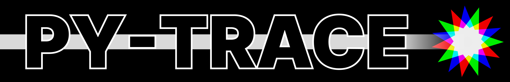
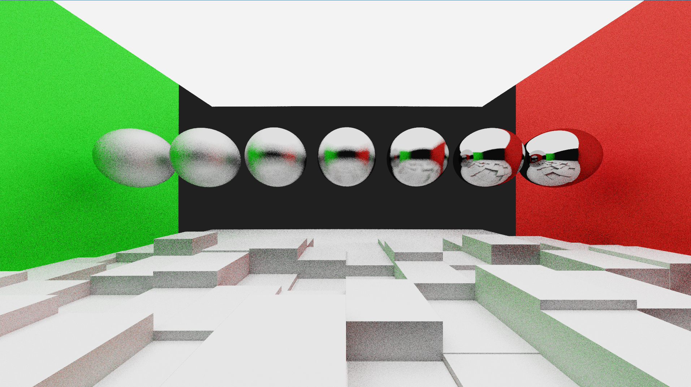
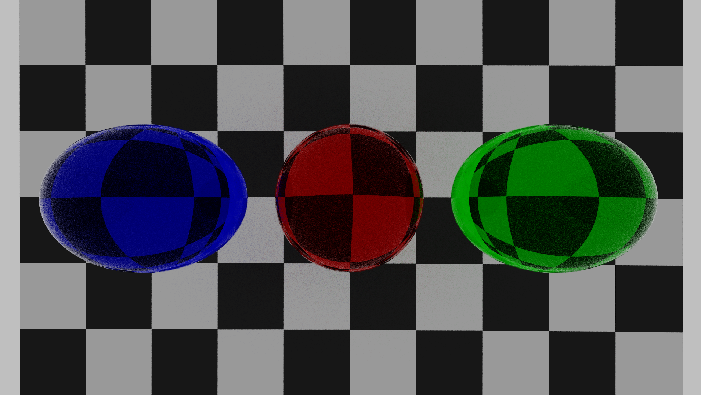
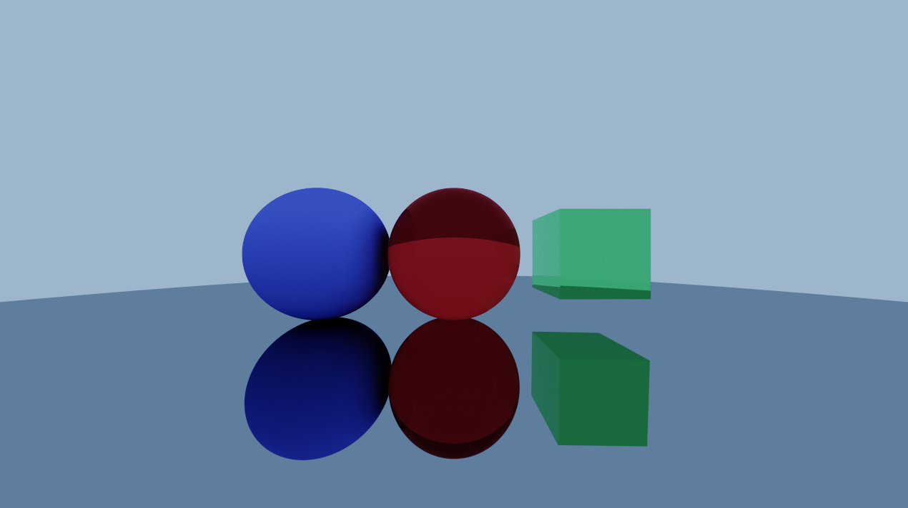
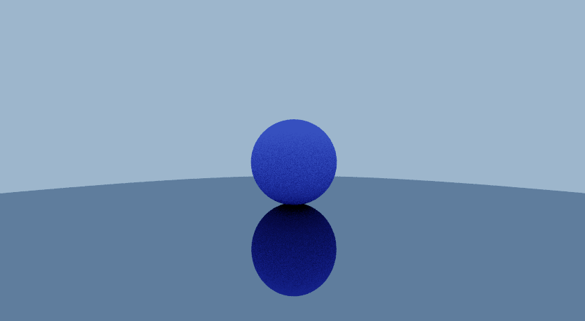

<br/>


<p align="center">
<b>PY-TRACE</b>, un simulateur réaliste de lumière (aussi nommé raytracer) pour des rendus 3D codé en python pour les trophées NSI
</p>

<br/>

### Résumé

Py-trace est un raytracer codée entièrement en python.
Le programme est capable de générer des images 3D réalistes en utilisant des techniques de rendus avancées en simulant
de la lumière. Contrairement aux rendus classiques que l'on peut voir dans les jeux-vidéos, on peut facilement implémenter des matériaux et formes complexes, telle que du métal, du plastique, du verre… De plus, ces techniques de rendus sont utilisées dans l'industrie du cinéma pour générer des images de synthèses réalistes.


Voici quelques exemples de rendus que l'on peut obtenir avec py-trace:

### Exemples


Scène nommée "demo-metal"

Dans cette scène, on peut observer le contrôle que l'on a sur la "rugosité" du métal, qui est un paramètre important pour le rendu réaliste du métal.
À droite, la sphère à une rugosité de $0$, ce qui donne un rendu très lisse, et à gauche, la sphère à une rugosité de 1, ce qui donne un rendu plus rugueux.
De plus, on peut observer l'illumination globale (ou nommée indirecte) sur le sol en bas.

-----


Scène nommée "demo-verre"


Dans scette scène on peut observer la capabilité de notre raytracer à simuler du verre, avec des reflets sur les bords (que l'on peut également observer dans la vraie vie).
On peut également observer la réfraction de la lumière ce qui déforme la grille.


-----


> Scène nommée "basic"

Cette scène est une représentation basique des capacités de notre raytracer, ici le sol est composé d'une sphère 'miroir', à gauche une sphère lambertienne (ou orthotrope), au centre une sphère en verre, et à droite un cube en verre vert.


## Les scènes

On n'a pas de moyen de faire des scènes en temps réel comme on peut le faire avec blender par exemples, cependant on les représente dans le code:

```python
# On décrit la caméra, sa position, là ou elle regarde...
camera = Camera(Vec3(0, 0, 1), Vec3(0, 0, 0), Vec3(0, 1, 0), 90, 16/9)

# on définit le monde avec sa caméra et la couleur de fond
world = World(camera, Color(0.5, 0.7, 1))

# Un lambertien (matériaux équivalent à du papier, ou du plâtre)
lambert = Lambertian(Color(0.3, 0.3, 0.8))

# Un métal de couleur (0.5,0.5,0.5) et une rugosité de 0.001 (très lisse)
metallic = Metal(Color(0.5, 0.5, 0.5), 0.001)

# Nos deux sphères, avec respectivement, leur coordonées, rayon et matériaux
sphere = Sphere(Vec3(0, 0, -1), 0.5, lambert)
sphere2 = Sphere(Vec3(0, -100.5, -1), 100, metallic)

# Et finnalement on les rajoute au monde
world.add_shape(sphere)
world.add_shape(sphere2)
```

Et cela donnera ceci:


## Prérequis 
Nous demandons une version récente de python, (testé sur 3.10 et 3.11+ sur Linux, mais devrait fonctionner également sur Windows)
- pygame:
    - Pour l'utilisation de l'interface graphique
- numpy  
    - Pour des fonctions mathématiques très rapides (sur les vecteurs tables etc...) qui compensent de très peut la lenteur du python.


## Utilisation

Pour lancer le programme, il suffit de lancer le fichier `main.py` avec python, et une fenêtre s'ouvrira avec le rendu de la scène.

Vous devez sélectionner la scène avec `--scene` suivi du nom de la scène, donc par exemple, pour avoir le rendu de la scène `demo-metal`, on lance la commande suivante :

```bash
$ python ./sources/main.py --scene metal-demo
```

Par limitation, la taille de la fenêtre est fixée au démarrage, mais peut être changée avec les paramètres `--width` et `--height` qui prennent en paramètre la largeur et la hauteur de la fenêtre.


## License


<a href="https://www.gnu.org/licenses/gpl-3.0.en.html"></a>

PY-TRACE a pour licence la GNU General Public License v3.0. Vous pouvez trouver la licence [ici](LICENSE).
