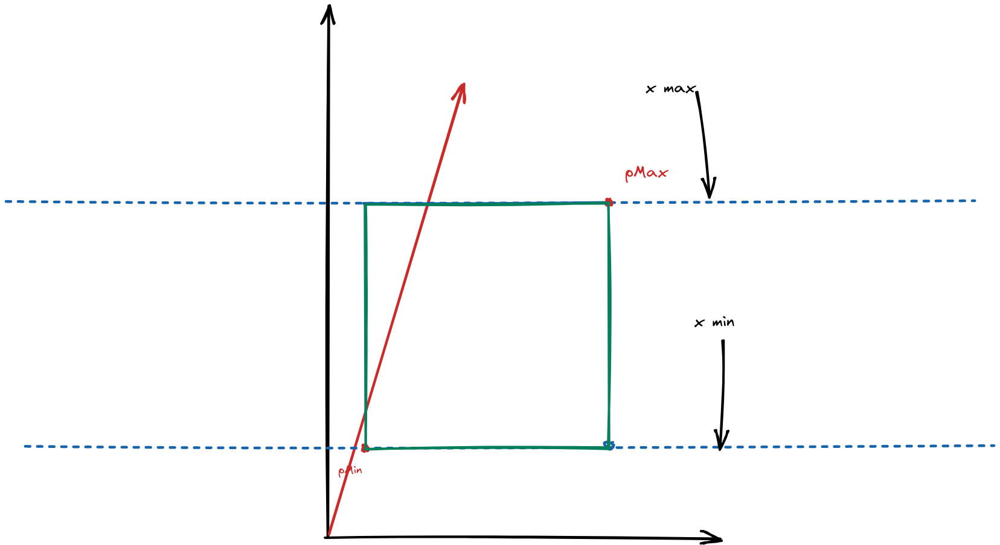
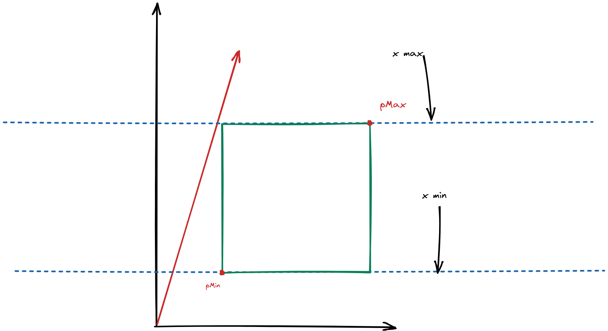
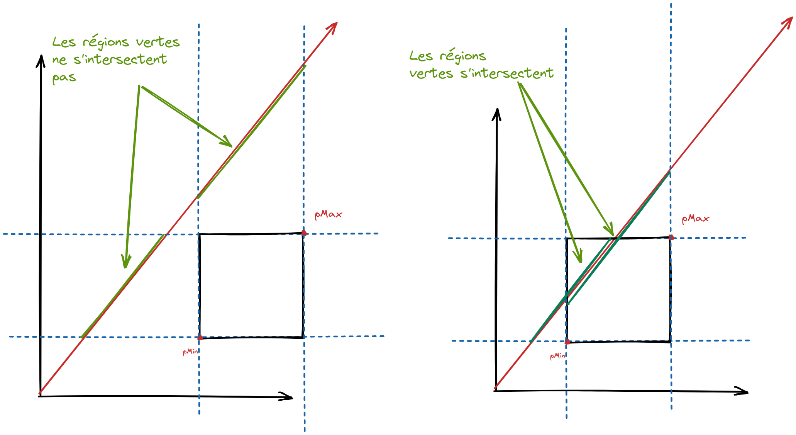
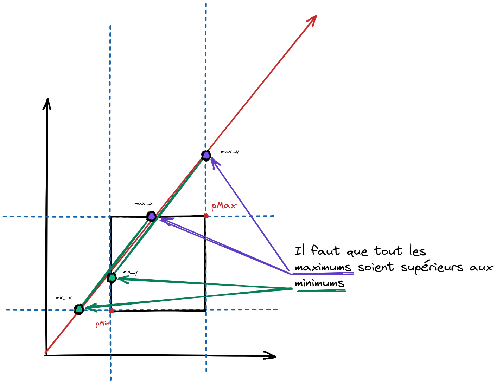

# Intersection entre un rayon et une boîte.

> Note: ici on suppose que la boîte n'a pas d'orientation, elle est alignés aux axes.

Si on a une boîte représentée par deux points, le point inférieur gauche et le point supérieur droit, on peut calculer les intersections avec une droite.

La droite de paramètre $t$ d'origine $p'$ et de direction $\vec{v}$ est donnée par:

$$
d = \begin{cases}
    x &= v_{x} *t + p'_{x} \\
    y &= v_{y} *t + p'_{y} \\
    z &= v_{z} *t + p'_{z}
\end{cases}
$$

Le cube est alors formée par les 6 faces, mais on va décomposer par axes.

De plus le cube est formé par deux positions: $p_{\text{min}}$ et $p_{\text{max}}$.

Donc, cela veut dire que pour un axe, ici $x$, il y a seulement deux valeurs possible:
$p_{\text{min }x}$ et $p_{\text{max }x}$.





Ainsi, si on cherches $t_x$ on aura:
$$
\begin{aligned}
v_{x} *t_x + p'_{x} &= p_{\text{min},x} \\
v_{x} *t_x &= p_{\text{min},x}  - p'_{x}\\
t_x &= \dfrac{p_{\text{min},x} - p'_{x}}{v_{x}} \\
\end{aligned}
$$

Cependant, qu'est ce qu'il arrive lorsque l'on a un rayon qui ne touches pas ?
Par exemple:



Ici, si on observe dans les deux axes, il faut que les deux axes soient compris entre les deux valeurs.

Par exemple:



Dans le premier cas à gauche, les deux axes ne sont pas compris entre les valeurs,
contrairement au deuxième.

Donc, il faut que pour le minimum d'un $t$ sur un axe, qu'il soit inférieur au maximum des autres axes:





Ainsi, on peut écrire:

$$
\begin{aligned}
t1_x &= \dfrac{p_{\text{min},x} - p'_{x}}{v_{x}} \\
t2_x &= \dfrac{p_{\text{max},x} - p'_{x}}{v_{x}} \\
t1_y &= \dfrac{p_{\text{min},y} - p'_{y}}{v_{y}} \\
t2_y &= \dfrac{p_{\text{max},y} - p'_{y}}{v_{y}} \\
t1_z &= \dfrac{p_{\text{min},z} - p'_{z}}{v_{z}} \\
t2_z &= \dfrac{p_{\text{max},z} - p'_{z}}{v_{z}} \\
\end{aligned}
$$
> note: chaque valeur correspond donc à une face du cube.


Ainsi, sur un axe, on aura:

$$
\begin{aligned}
t_\text{min,x} &= \min(t1_x, t2_x) \\
t_\text{max,x} &= \max(t1_x, t2_x) \\
t_\text{min,y} &= \min(t1_y, t2_y) \\
t_\text{max,y} &= \max(t1_y, t2_y) \\
t_\text{min,z} &= \min(t1_z, t2_z) \\
t_\text{max,z} &= \max(t1_z, t2_z) \\
\end{aligned}
$$

De plus, on sait que si:

$$
\begin{aligned}
\begin{cases}
t_\text{min,x} \leq q \\
 t_\text{min,y} \leq q \\
   t_\text{min,z} \leq q
\end{cases}\\
\begin{cases}
t_\text{min,x} \leq \max{(t_\text{min,x},t_\text{min,y},t_\text{min,z}  ) } \leq q \\
 t_\text{min,y} \leq \max{(t_\text{min,x},t_\text{min,y},t_\text{min,z} )  } \leq q \\
   t_\text{min,z} \leq \max{(t_\text{min,x},t_\text{min,y},t_\text{min,z} )  } \leq q
\end{cases}
\end{aligned}
$$

Et:
$$
\begin{aligned}
\begin{cases}
t_\text{max,x} \geq q \\
 t_\text{max,y} \geq q \\
   t_\text{max,z} \geq q
\end{cases}\\
\begin{cases}
t_\text{max,x} \geq \min{(t_\text{max,x},t_\text{max,y},t_\text{max,z}  ) } \geq q \\
 t_\text{max,y} \geq \min{(t_\text{max,x},t_\text{max,y},t_\text{max,z} )  } \geq q \\
   t_\text{max,z} \geq \min{(t_\text{max,x},t_\text{max,y},t_\text{max,z} )  } \geq q
\end{cases}
\end{aligned}
$$

Ainsi, dire:

"Touts les minimums doivent être supérieurs à tout les maximums" revient à dire:

$$
\min{(t_\text{max,x},t_\text{max,y},t_\text{max,z}  ) } \geq \max{(t_\text{min,x},t_\text{min,y},t_\text{min,z} )  }
$$

Et donc, cette condition est vraie si et seulement si il y a une intersection.

Cette condition est plus simple si elle est exprimée de manière algorithmique:

```python

def ray_aabb_intersection(ray, aabb):
    trmin = (0,0,0) # chaque axe aura un minimum
    trmax = (0,0,0) # chaque axe aura un maximum

    # on itère sur tout les axes
    # 1 = x
    # 2 = y
    # 3 = z
    for axe in range(3):
        t0 = (aabb.min[axe] - ray.origin[axe]) / ray.direction[axe]
        t1 = (aabb.max[axe] - ray.origin[axe]) / ray.direction[axe]

        # on fait que t0 soit toujours le minimum
        if(t0 > t1):
            t0, t1 = t1, t0

        trmin[axe] = t0
        trmax[axe] = t1

    # on prend le minimum des maximums
    # et le maximum des minimums
    tmin = max(trmin)
    tmax = min(trmax)

    # si tmin est supérieur à tmax, il n'y a pas d'intersection
    return tmin <= tmax
```
