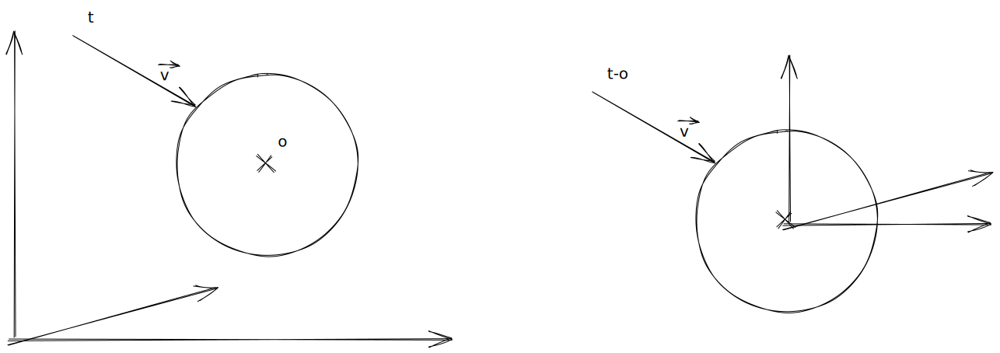

# Intersection entre une droite et une sphère:

Soit un point $t$ et un vecteur $\vec{v}$ directeur d'une droite, avec une sphère d'origine $O$ et de rayon $r$:

Cela revient à faire une intersection avec une sphère d'origine $0$ et une droite d'origine $t'=t-O$.

.

Ainsi, l'intersection de la droite à pour équation:

$$\begin{cases}
        x &= v_{x} *t + p'_{x} \\
        y &= v_{y} *t + p'_{y} \\
        z &= v_{z} *t + p'_{z}
    \end{cases}$$

Et la sphère a pour équation: $x^2+y^2+z^2=r^2$.

Ainsi, on cherches pour le paramètre $t$ de la droite:

$$\begin{cases}
        x &= v_{x} *t + p'_{x} \\
        y &= v_{y} *t + p'_{y} \\
        z &= v_{z} *t + p'_{z} \\
        x^{2}+y^{2}+z^{2}&=r^{2}
\end{cases}$$

$$\begin{aligned}
r^{2} &= x^{2} + y^{2} + z^{2}\\
r^{2} &= (\vec{v}_{x}*t + p'_{x})^{2} + (\vec{v}_{y}*t + p'_{y})^{2} + (\vec{v}_{z}*t + p'_{z})^{2}\\
r^{2} &= (\vec{v}_{x}*t)^{2} + (\vec{v}_{y}*t)^{2} + (\vec{v}_{z}*t)^{2} + 2(p'_{x}*\vec{v}_{x} *t + p'_{y} *\vec{v}_{y}*t + p'_{z} *\vec{v}_{z} *t) + (p'^{2}_{z} + p'^{2}_{y} + p'^{2}_{z})\\
r^{2} &= (\vec{v}_{x}*t)^{2} + (\vec{v}_{y}*t)^{2} + (\vec{v}_{z}*t)^{2} + 2t(p'_{x}*\vec{v}_{x}  + p'_{y} *\vec{v}_{y} + p'_{z} *\vec{v}_{z} ) + ||p||^{2}\\
r^{2} &= (\vec{v}_{x}*t)^{2} + (\vec{v}_{y}*t)^{2} + (\vec{v}_{z}*t)^{2} + 2t(p' \cdot \vec{v} ) + ||p||^{2}\\
r^{2} &= \vec{v}_{x}^{2}*t^{2} + \vec{v}_{y}^2*t^2 + \vec{v}_{z}^{2}*t^{2} + 2t(p' \cdot \vec{v} ) + ||p||^{2}\\
r^{2} &= (\vec{v}_{x}^{2} + \vec{v}_{y}^2 + \vec{v}_{z}^2)*t^{2} + 2t(p' \cdot \vec{v} ) + ||p||^{2} \\
r^{2} &= (||\vec{v}||^2)*t^2 + 2t(p' \cdot \vec{v} ) + ||p||^{2} \\
0 &= (||\vec{v}||^{2})*t^{2} + 2t(p' \cdot \vec{v} ) + ||p||^{2} - r^{2} \\
\end{aligned}
$$

Or, dans notre contexte, on sait que $||\vec{v}|| = 1$. Alors:

$$\begin{aligned}
    0 &= (||\vec{v}||^{2})*t^{2} + 2t(p' \cdot \vec{v} ) + ||p||^{2} - r^{2}\\
    0 &= t^{2} + 2t(p' \cdot \vec{v} ) + ||p||^{2} - r^{2}
\end{aligned}$$
Ici on a une équation du second degré. Avec:

$$\begin{aligned}
    c &= ||p||^{2}-r^{2}\\
    b &= 2(p' \cdot \vec{v})\\
    a &= 1\\
    \Delta &= b^{2} - 4ac
\end{aligned}$$
$$\begin{cases}
    \text{Si } & \Delta < 0 \text{ alors il n'y a pas d'intersection}\\
    \text{Si } & \Delta \geq 0 \text{ alors: } t = \dfrac{-b \pm \sqrt{\Delta}}{2a} \\
\end{cases}$$

Ainsi, les deux intersections sont les points: $t_1$ et $t_2$ de la droite.