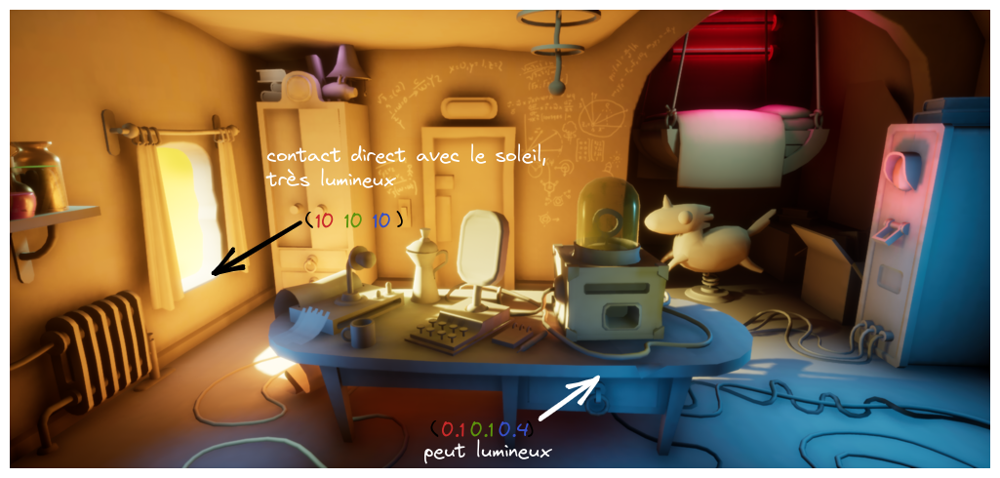
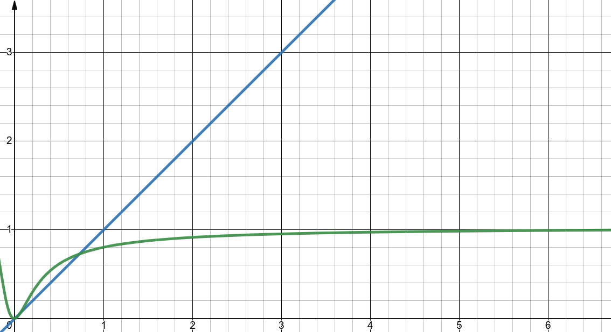

# Qu'est ce que le tonemapping ?

Dans une image, on a toujours des pixels ayant 3 valeurs allant de 0 à 255. $(R,G,B)$.

Cependant, dans notre raytracer, on utilises des valeurs flottante qui vont de $[0;+\infty[$ mais: Pourquoi ?

En réalité, on a surtout des valeurs qui vont de $[0;1[$ qui correspondent aux valeurs de 0 à 255.

Donc, $(0,0,1)$ correspond à $(0,0,255)$; $(0.5,0.5,0.5)$ correspond à $(127,127,127)$, etc.

Cependant, on a des valeurs qui vont au dessus de 1. Elles servent à décrire des éléments lumineux, tel que des lumières.
Donc, une lumière rouge pourrait avoir une valeur de $(10,0,0)$.

Cependant, lorsque l'on doit afficher ces couleurs, si elles vont de $[0;1[$ on les transformes juste vers $[0;255[$, mais comment on fait si elles vont de $[1;+\infty[$ ?

C'est là que le tonemapping intervient.

Le tonemapper va transformer une valeur de $[0;+\infty[$ en une valeur de $[0;1[$.

## Une implémentation de ACES

ACES est un tonemapper qui a été développé par la société de visualisation de films, [Academy Color Encoding System](https://en.wikipedia.org/wiki/Academy_Color_Encoding_System).

Une implémentation rapide de ce tonemapper est disponible dans le fichier `color.py`, on a l'équation:

$$
f(x) = \frac{x * (2.51 * x + 0.03)}{x * (2.43 * x + 0.59) + 0.14}
$$

On peut étudier les fonctions ici:

La fonction en vert est la valeur tonemappé et la fonction en bleu est la valeur non tonemappé.

On voit bien que cela résout le problème de la valeur qui va au dessus de 1.

----

Ainsi, à la place d'avoir une image qui ressemble à cela (ici c'est une image avec une lumière très importante):

On aura ceci:

> Images provenant de [tonemmping (blog post de bruop)](https://bruop.github.io/tonemapping/)

### Sources et références
- [Tonemapping](https://en.wikipedia.org/wiki/Tone_mapping)
- [tonemmping (blog post de bruop)](https://bruop.github.io/tonemapping/): les images d'exemples proviennent de cet article.
- [aces cinematic tonemapping](https://www.shadertoy.com/view/XsGfWV)
- [aces filmic colors (interactive)](https://www.shadertoy.com/view/tdffDl)